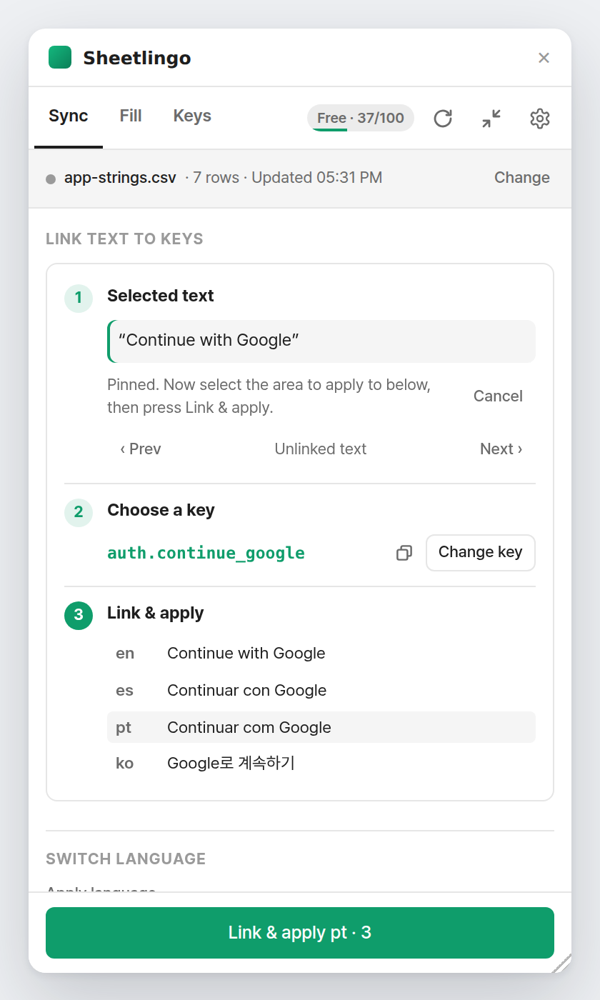
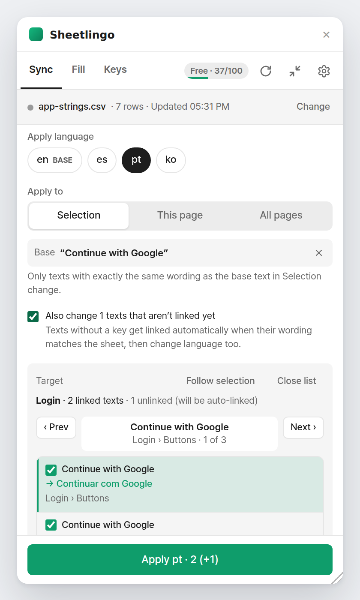
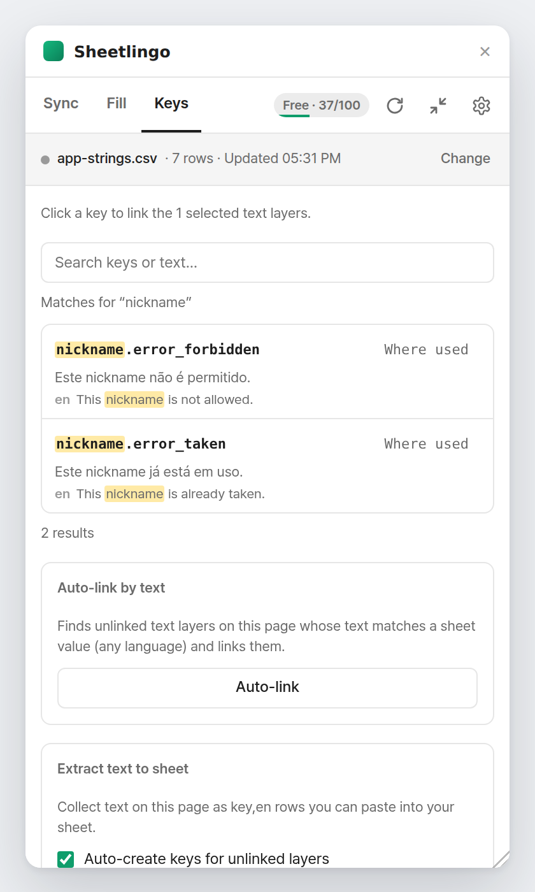
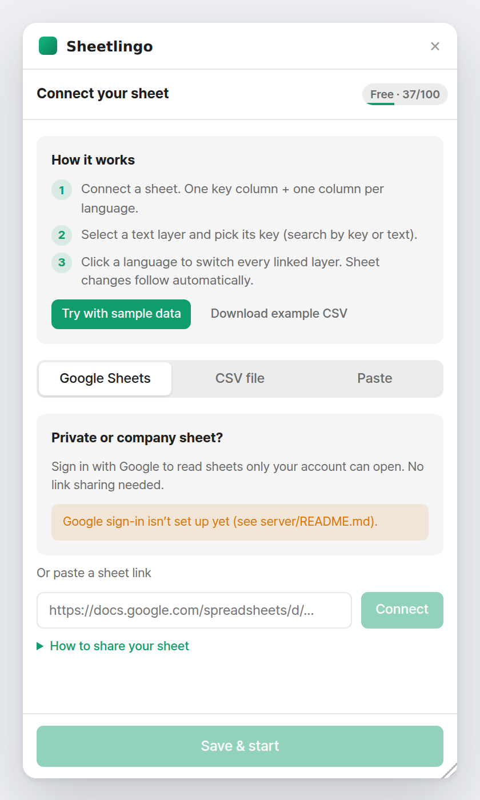
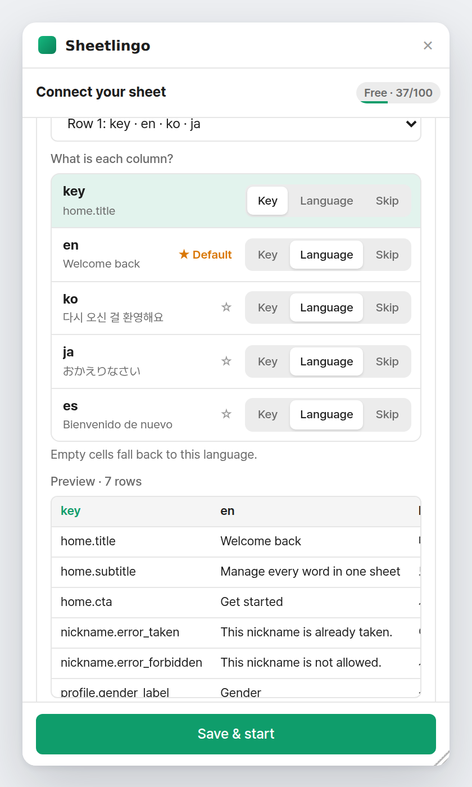
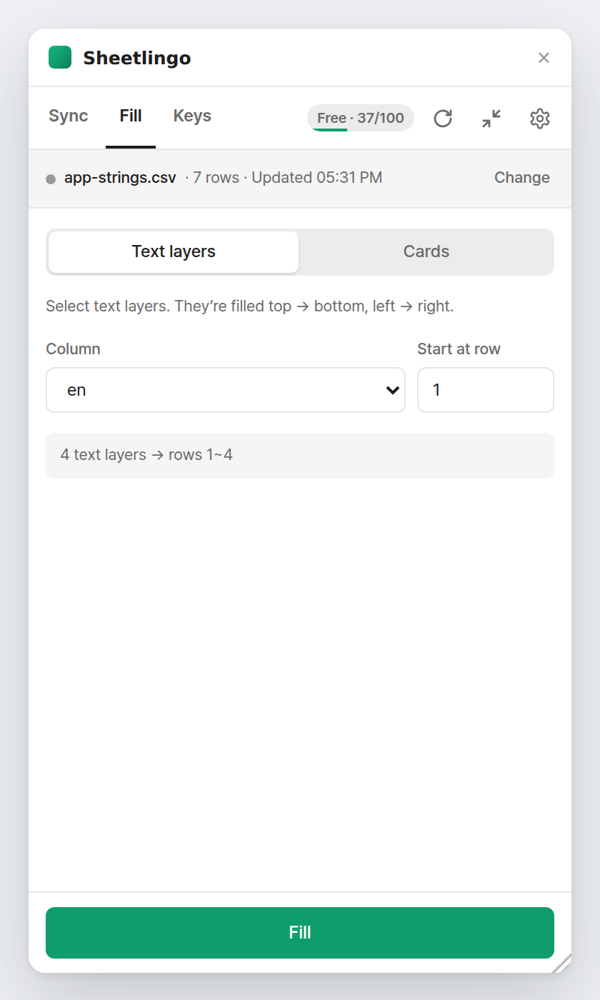
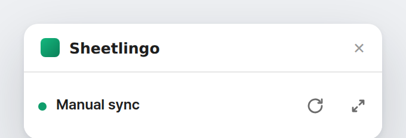
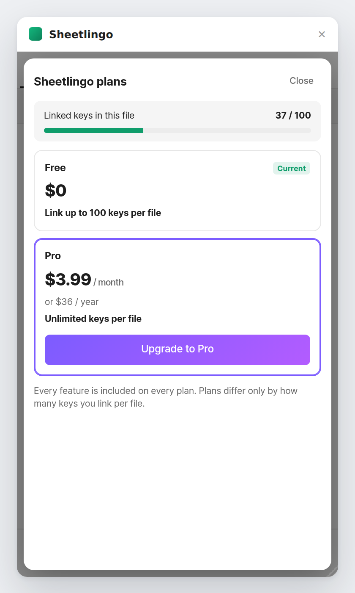

<p align="center">
  
</p>

<h1 align="center">Sheetlingo</h1>

<p align="center">
  <b>Sync Figma text with your spreadsheet by key — and switch languages in one click.</b><br/>
  Google Sheets · CSV · Paste &nbsp;|&nbsp; 7 UI languages &nbsp;|&nbsp; Free up to 100 linked keys per file
</p>

<p align="center">
  
  
  
</p>

---

## Why

Product copy and translations live in a spreadsheet. Designs live in Figma. Keeping them in sync by copy‑paste is slow and error‑prone.
Sheetlingo links each text layer to a **key** in your sheet, so every language is one click away and sheet edits flow straight into the design.

| Sheet | | Figma |
|---|---|---|
| `auth.continue_google` · en `Continue with Google` · pt `Continuar com Google` | → | a text layer linked to `auth.continue_google` shows whichever language you pick |

---

## Features

### 1. Connect a sheet


- **Google Sheets** — public link, or **Sign in with Google** for private / company sheets (no link sharing needed).
- **CSV file** or **Paste** cells straight from Sheets / Excel.
- Access is checked immediately, with a clear message when a sheet isn't shared.
- New here? **Try with sample data** or download an example CSV.

<br clear="right"/>

### 2. Map your columns


- Pick **which row holds the column names** (headers don't have to be on row 1).
- Mark each column as **Key / Language / Skip** while seeing a sample value.
- ★ sets the **default language** — empty cells fall back to it.

<br clear="right"/>

### 3. Link text to keys


1. **Select a text layer** — its wording appears in step 1.
2. **Choose a key** — keys matching the text are suggested automatically; search by key *or* by any language's wording.
3. **Link & apply** — preview every language before confirming.

The picked key is **pinned**, so you can select a frame on the canvas as the area to apply to without losing it.
Editing a linked text by hand (so it no longer matches its key) unlinks it automatically.

<br clear="right"/>

### 4. Switch language — exactly where you want


- **Apply to**: Selection · This page · All pages.
- With a base text, only texts with **exactly the same wording** change — texts that merely share the key but were edited are left alone.
- **Target list**: see every layer that will change, where it lives (`Login › Buttons`), and the new value (`→ Continuar com Google`). Step through with **Prev / Next** to jump to each on the canvas, or uncheck to exclude.
- Reports list missing keys, fallbacks, missing fonts (with a **Get font** link) and overflowing text.

<br clear="right"/>

### 5. Keys


- Search all keys by key or wording, with highlights.
- **Where used** — list every layer on the page linked to a key.
- **Auto-link** the whole page by exact wording, or **Extract** existing text to a `key,en` CSV (keys generated for you).

<br clear="right"/>

### 6. Fill with data


- **Text layers** — fill a column into the selected layers in reading order (top → bottom, left → right).
- **Cards** — one card per row; layer names are matched to column names automatically.
- Filled layers remember their cell and refresh on re-sync.

<br clear="right"/>

### 7. Live sync


- Minimize Sheetlingo to a small **live bar** while you work.
- Private sheets are checked every 10 s, public links every 60 s; the dot flashes green when something syncs.
- ↻ syncs immediately. (Figma plugins run only while their window is open.)

<br clear="right"/>

### 8. Plans


| | Free | Pro |
|---|---|---|
| Linked keys per file | up to 100 | Unlimited |
| Every feature | ✓ | ✓ |
| Price | $0 | $3.99 / month or $36 / year |

Payments use Figma's native checkout. A Free file over 100 linked keys is locked (links are kept) until upgrade or unlinking.

<br clear="right"/>

---

## Sheet format

| key | en | es | pt | ko |
|---|---|---|---|---|
| home.title | Welcome back | Bienvenido de nuevo | Bem-vindo de volta | 다시 오신 걸 환영해요 |
| auth.continue_google | Continue with Google | Continuar con Google | Continuar com Google | Google로 계속하기 |

- One key column + one column per language (any codes or names).
- Columns / keys starting with `#` are ignored (use them for notes).
- Inline tags such as `<b>…</b>` can be stripped automatically.

---

## Getting started (development)

**Requirements:** Figma desktop app · Node.js 22 (on WSL use nvm so the Linux Node is used).

```bash
nvm use
npm install
npm run build      # dist/code.js + dist/ui.html
npm run watch      # rebuild on save
```

Figma → **Plugins → Development → Import plugin from manifest…** → `manifest.json`, then run **Sheetlingo**.

| Command | What it does |
|---|---|
| `npm run watch` | Dev build on save (includes a Free/Pro switcher in the plans sheet) |
| `npm run build` | Type check + production build |
| `npm run typecheck` | Type check only |

Private Google Sheets need the small auth server in [`server/`](server/README.md) (Cloudflare Worker).
Full test checklist: [`docs/TESTING.md`](docs/TESTING.md).

### Troubleshooting

| Problem | Fix |
|---|---|
| `UNC paths are not supported` / `tsconfig.json not found` | Windows npm is running inside WSL → `nvm use` |
| Blank window or "error loading the plugin environment" | `npm run build`, then re-import `manifest.json` |
| Old behaviour after updating | Close and reopen the plugin; check the build time at the bottom of ⚙ Settings |
| "Couldn't edit (missing font)" | Install the font shown in the report (use **Get font**) and apply again |

---

## Project structure

```
src/
  shared/      types, constants (limits, price), sheet → dictionary, exact-text matcher
  code/        Figma main thread: sync, link, fill, extract, edit watcher, payments
  ui/          React UI (views, key picker, Google sign-in, sheet loading)
  ui/locales   en · ko · ja · zh-CN · es · fr · de
server/        Cloudflare Worker for Google sign-in (private sheets)
docs/          plan, listing copy, testing checklist, screenshots
```

---

<p align="center"><sub>© Sheetlingo. All rights reserved. · Support: efforthye@gmail.com</sub></p>
