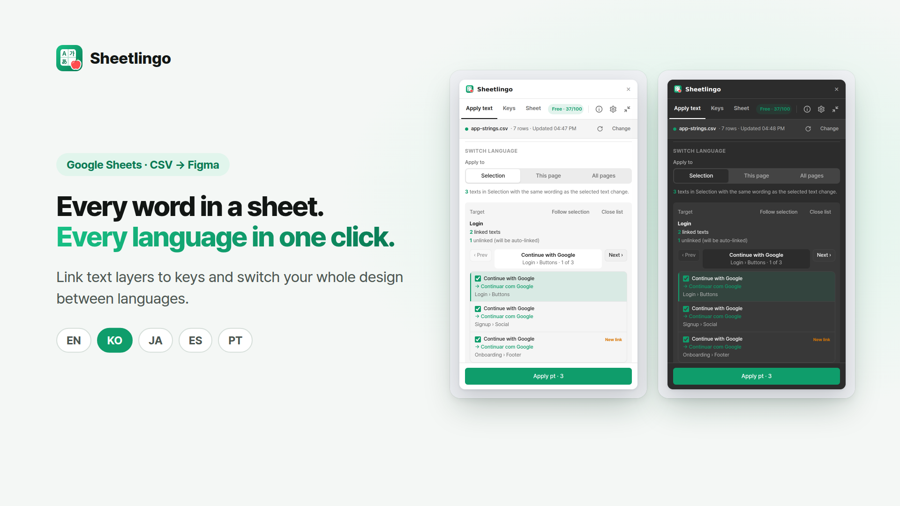
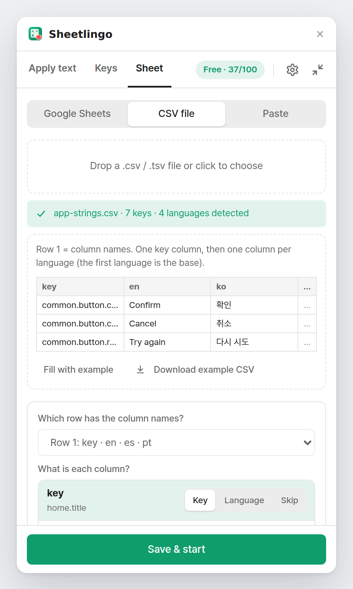
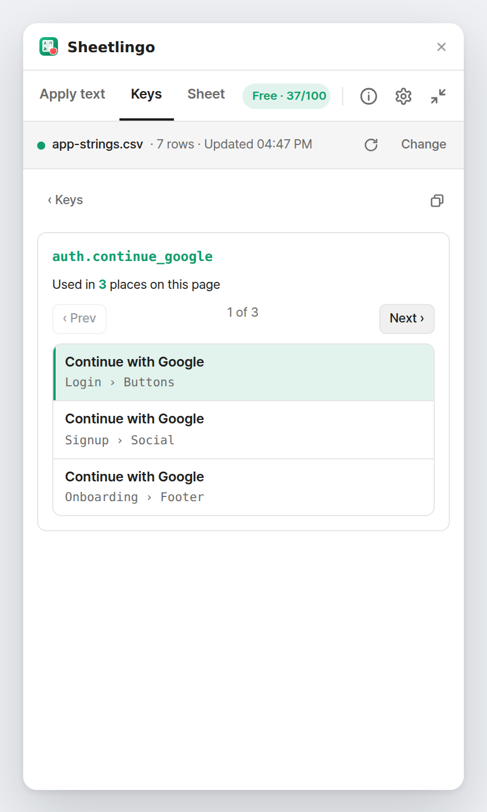
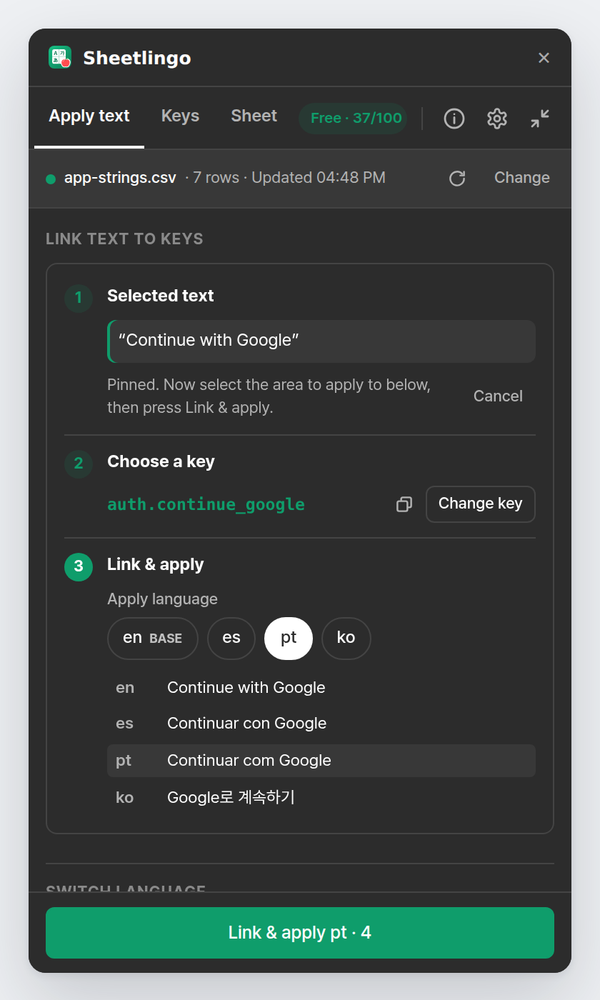
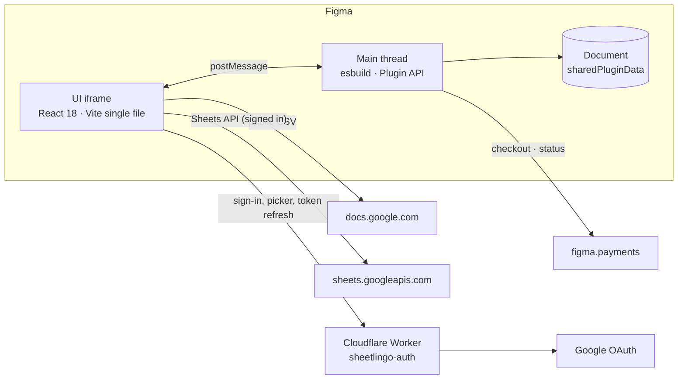

<p align="center">
  
</p>

<h1 align="center">Sheetlingo</h1>

<p align="center">
  <b>Every word in a sheet. Every language in one click.</b><br/>
  A Figma plugin that links text layers to spreadsheet keys and switches your whole design between languages.<br/>
  Google Sheets · CSV · Excel paste &nbsp;|&nbsp; 7 UI languages &nbsp;|&nbsp; Free up to 100 linked keys per file
</p>

<p align="center">
  <a href="https://www.figma.com/community/plugin/1686971732936550159/sheetlingo-google-sheets-csv-localization-sync"><b>▶ Get Sheetlingo on Figma Community</b></a>
</p>

<p align="center">
  
</p>

---

## The logo


**Sheet + lingo.** The white card is a spreadsheet, and its cells hold **A · 가 · あ**: one sheet, many languages.
The red apple in the corner is a small pun: *lingo* sounds like **ringo (りんご)**, Japanese for apple.
Every glyph is drawn as a vector path, so the icon looks identical everywhere, with or without the fonts installed.

<br clear="left"/>

---

## Features

Sheetlingo has three tabs: **Apply text**, **Keys** and **Sheet**. Options live behind ⚙.

### 1. Connect any sheet (Sheet tab)

<p align="center"></p>

Paste a **Google Sheets** link, drop a **CSV** file, or **paste cells** straight from Excel or Numbers.
Private and company sheets work too: **Sign in with Google** and pick the file in Google's own picker, no link sharing needed.
Re-upload a CSV (or switch sheets) and the new values are applied to every linked text in the file right away.

### 2. Map your columns

<p align="center"></p>

Choose which row holds the column names (it doesn't have to be row 1), then mark each column as **Key**, **Language** or **Skip** while seeing a sample value.
★ marks the base language; empty translations fall back to it.

### 3. Link a text to its key (Apply text tab)

<p align="center"></p>

Three steps in one box: **① the selected text** (shown in full) → **② the key** → **③ the language**.
Only keys whose value is **exactly** the selected wording are suggested; search by key or any language for the rest.
The text stays pinned, so you can then click a frame and every **identical** text inside it is linked too.
Select a frame to see every text inside it, linked or not.
Edit a linked text by hand and it unlinks itself, so your manual change is never overwritten.

### 4. Switch languages, exactly where you want

<p align="center"></p>

Apply to the **selection**, **this page** or **all pages**. Only texts with exactly the same wording as the selected text change.
Before anything changes you see how many layers will change, where each one lives (`Login › Buttons`) and its new value; texts that already match are left unchecked.
Pressing Apply shows a short confirmation, a progress bar for big files, and a result:

- Changed 2 to pt
- 1 already matched, left as is
- Linked 1 to the key

Missing fonts and locked layers are reported as **failures**, with the font you need to install. Nothing is half-linked.

### 5. Keys: where is this key used?

<p align="center"> </p>

The Keys tab lists the keys linked on this page, **most used first** (`3 used`). Search to find any key in the sheet.
Click a key to see every place it is used and step through them with **Prev / Next** on the canvas.

### 6. Live sync

<p align="center"></p>

With a Google sheet connected, Sheetlingo checks for edits while the plugin is open (private sheets every 10 s, public links every 60 s) and applies them to the page.
Minimize it to a small bar while you work; the green dot flashes when something syncs. You can also re-sync from Figma's right panel without opening the plugin.

### 7. Simple pricing

<p align="center"></p>

| | Free | Pro |
|---|---|---|
| Linked keys per file | up to 100 | Unlimited |
| Every feature | ✓ | ✓ |
| Price | $0 | $4 / month or $36 / year (25% off) |

Only links to keys that exist in the connected sheet count. If Pro ends, nothing is deleted: links and texts stay, and only files over 100 keys pause until renewal.

Each tab also has an **ⓘ** button that explains what it does in two lines.

### 8. Light and dark

<p align="center"> </p>

Sheetlingo follows Figma's theme automatically (`themeColors`), so it looks at home in light and dark mode, in any of its 7 UI languages.

---

## Under the hood



**Two halves.** Figma plugins run as a sandboxed main thread (document access) plus a UI iframe (network, DOM).
The UI loads and parses the sheet, the main thread finds and edits text layers, and they talk through typed messages (`src/shared/types.ts`).

**Where data lives**

| What | Where | Who sees it |
|---|---|---|
| Key, language and written-text stamp on each text layer | `sharedPluginData` (namespace `sheetlingo`) in the Figma file | Anyone with the file |
| Sheet source, column mapping, current language | Document root `sharedPluginData` | Anyone with the file |
| Linked-key registry (for the Free limit) | Document root, updated incrementally | Anyone with the file |
| Cached sheet, UI language, window size, Google tokens | `figma.clientStorage` | Only this user on this computer |

**Matching rules.** Linking, suggestions and switching use **exact normalized wording** only (whitespace and case folded, optional inline tags stripped), so a similar but different text is never touched.
A frame or page scope changes only texts identical to the selected one; texts linked to another key are relinked, and same-key texts whose wording was edited are left alone.

**What counts as linked.** Only a link Sheetlingo made (`sharedPluginData`) to a key that exists in the connected sheet. Layer names such as `#nav.title` are a designer's own naming and are ignored.
Each link stamps the wording it wrote, so a hand edit (even one made while the plugin was closed) is detected and unlinks that text only.

**Performance.** Scans are scoped to the selection or page and use `findAllWithCriteria`. Counting keys across a whole file is never done automatically (it froze big files), only through an explicit *Recount*.
Applying reports progress and yields to Figma every 40 layers. Fonts are loaded once per family; a layer whose font is missing is reported as failed and its link is rolled back.

**Google sign-in for private sheets.** A small Cloudflare Worker ([`server/`](server/README.md)) runs the OAuth code flow and Google Picker on `sheetlingo-auth.efforthye.workers.dev`.
It requests only `drive.file` (files the user picks), `openid` and `email`. The refresh token is sealed with AES-GCM before it leaves the Worker and is stored only on the user's machine; the Worker keeps a sign-in result in KV for at most 10 minutes.
Private sheets check Drive `modifiedTime` every 10 s and download only when it changed; public links re-download every 60 s.

**Payments.** Figma's native checkout (`figma.payments`). Pro = an active subscription; the Free limit is usage based (linked keys per file), not time based.

**Internationalization.** 7 UI languages (`src/ui/locales`), typed against the English file so a missing string is a compile error, with English fallback at runtime.

**Build.** TypeScript everywhere. The main thread is bundled by esbuild (ES2017), and the UI by Vite into one inline HTML file with a classic script, which Figma's iframe requires. Version and build time are baked in and shown in ⚙ Settings.

**What's included**

```
src/
  shared/      message types, limits & price, sheet → dictionary, exact-text matcher
  code/        main thread: sync, link, key usage, edit watcher, key registry, payments
  ui/          React UI: Apply text / Keys / Sheet tabs, key picker, Google sign-in, mini bar
  ui/locales   en · ko · ja · zh-CN · es · fr · de
server/        Cloudflare Worker: OAuth, Picker, home / privacy / terms pages
docs/          listing copy & images, plan, testing checklist, screenshots, sample CSVs
scripts/       build helpers (main-thread bundle, auth server URL)
```

---

## Sheet format

| key | en | es | pt | ko |
|---|---|---|---|---|
| home.title | Welcome back | Bienvenido de nuevo | Bem-vindo de volta | 다시 오신 걸 환영해요 |
| auth.continue_google | Continue with Google | Continuar con Google | Continuar com Google | Google로 계속하기 |

- One key column plus one column per language (any codes or names).
- Columns or keys starting with `#` are ignored, so you can keep notes.
- Inline tags such as `<b>…</b>` can be stripped automatically.

---

## Development

**Requirements:** Figma desktop app and Node.js 22 (on WSL use nvm so the Linux Node is used).

```bash
nvm use
npm install
npm run build      # dist/code.js + dist/ui.html
npm run watch      # rebuild on save (dev build with a Free/Pro switcher)
```

Figma → **Plugins → Development → Import plugin from manifest…** → `manifest.json`, then run **Sheetlingo**.

| Command | What it does |
|---|---|
| `npm run watch` | Dev build on save |
| `npm run build` | Type check + production build (publish this one) |
| `npm run typecheck` | Type check only |

- Auth server setup, deployment record and troubleshooting: [`server/README.md`](server/README.md)
- Publishing on Figma Community: [`docs/LISTING.md`](docs/LISTING.md)
- Test checklist: [`docs/TESTING.md`](docs/TESTING.md)

### Troubleshooting

| Problem | Fix |
|---|---|
| `UNC paths are not supported` / `tsconfig.json not found` | Windows npm is running inside WSL: run `nvm use` |
| Blank window or "error loading the plugin environment" | `npm run build`, then re-import `manifest.json` |
| Old behaviour after updating | Close and reopen the plugin; check the build time at the bottom of ⚙ Settings |
| "Couldn't edit (missing font)" | Install the font shown in the report (use **Get font**) and apply again |

---

<p align="center"><sub>© Sheetlingo · <a href="https://sheetlingo-auth.efforthye.workers.dev/privacy">Privacy</a> · <a href="https://sheetlingo-auth.efforthye.workers.dev/terms">Terms</a> · efforthye@gmail.com</sub></p>
